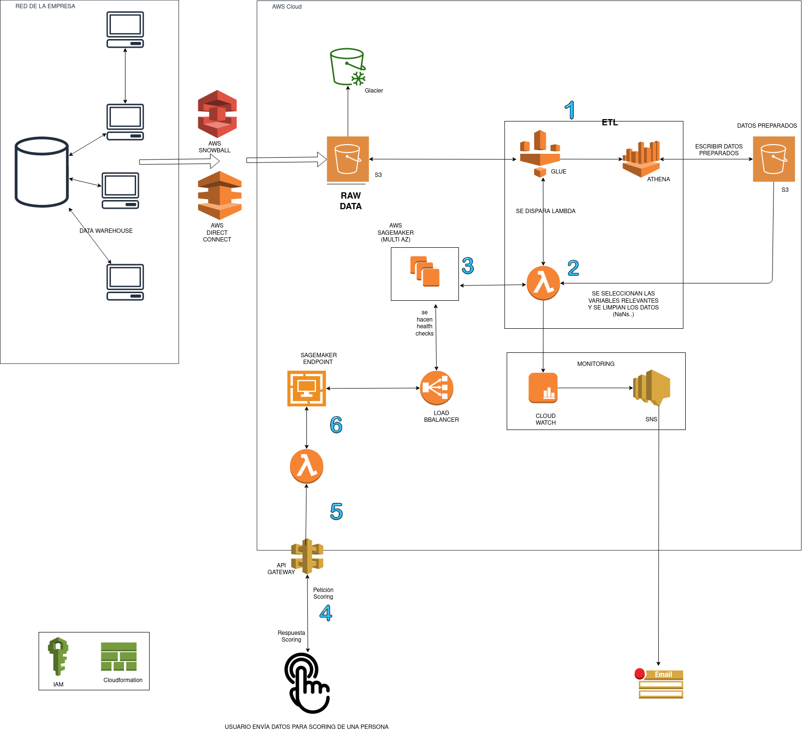

# Carlos Sánchez Vega

### Prueba de diseño

Para el desarrollo de ésta arquitectura se ha optado por elegir un entorno cloud, más concretamente Amazon Web Services. 
El motivo principal por el que elijo éste distribuidor cloud, en lo personal, es porque es el distribuidor con el que cuento con más experiencia.
En cuanto a las ventajas de una migración de una arquitectura a un distribuidor cloud, podríamos citar las siguientes: 
  - Económicos: se paga únicamente por los recursos consumidos.
  - Disponibilidad y latencia: Amazon dispone de varias zonas regiones y zonas geográficas alrededor del mundo, lo que se traduce en una menor latencia y una mejor experiencia de usuario. 
  - Seguridad: AWS ofrece numerosos servicios que protegen nuestras arquitecturas, garantizando así una seguridad muy superior a cualquier infraestructura física.


### Arquitectura
Se ha diseñado el pipeline de los dos casos de uso:
1. Creación del modelo predictivo
2. Aplicación en tiempo real para la obtención de la predicción



### Creación del modelo predictivo

Suponemos que se parte de una situación inicial en la que la empresa posee su propio datawarehouse y los datos no están aún en la nube, por lo que habría que importar los datos a AWS .
- Si el volumen de datos no es muy grande, se usará AWS Direct Connect (una conexión de red dedicada entre nuestra red y una de las ubicaciones de AWS).
- Si el volumen de datos es masivo, se usará AWS Snowball(es un servicio para migrar datos de forma masiva)

Como destino de nuestro origen de datos, tendremos el bucket de S3, con los datos en crudo ("Raw") del warehouse en local.
Se ha elegido S3 por su escalabilidad y por su "durabiliad" (AWS dice ser de 99.99 %). Para aumentar su disponibilidad, configuraremos el bucket para que sea multizona.
Además, crearemos una política para crear un backup de los datos "en crudo" y almacenarlos en AWS Glacier (de forma que podamos tener un backup del histórico de datos del warehouse de la empresa)

Una vez que los datos se encuentran en nuestra arquitectura AWS, distinguiremos las siguientes fases:

## Creación del modelo predictivo

 ### 1 — Preparación de los datos
Una vez insertados los datos en el bucket de datos en crudo, crearemos un catálogo de datos con ayuda de AWS Glue.Gracias al catálogo de datos,y mediante queries con Athena, podremos extraer la información relevante de los diferentes orígenes de datos, que aunaremos en un dataframe.
Guardaremos  éste dataframe un un bucket de S3 ("Datos preparados"), que contendrá toda la información susceptible de ser útil para nuestro caso de uso. Un paso importante a destacar es que, en ésta fase, se podrían realizar técnicas de reducción de dimensionalidad (PCA...) para seleccionar las variables importantes.
Además,mediante Glue desencadenaremos la fase 2 del pipeline.

 ### 2 — Limpieza de los datos
Tendríamos que hacer una validación de los datos para limpiar los datos (eliminar NaNs, reemplazar los strings inválidos, etiquetar variables categóricas...). Para ello podríamos usar una lambda con pandas, que limpiaría los valores nulos, eliminaría valores incorrectos, etc, o scikit-learn para etiquetar las variables categóricas...
Además, ésta lambda separá  el conjunto de datos para crear el conjunto de datos de entrenamiento.
Como posible mejora se han añadido a la arquitectura los servicios de Cloudwatch  y SNS, de forma que si se produjera una incidencia en la ejecución de la lambda, se enviara un mail (mediante SNS) al usuario para informar al usuario de cualquier incidente.


### 3 — Predicción
Para hacer las predicciones usaremos Sagemaker, de forma que podremos entrenar y crear el modelo a partir de los datos que tenemos y almacenar el modelo obtenido. Para realizar nuestros análisis podríamos usar un notebook de jupyter en una instancia de Sagemaker.En el caso de que nuestros datos no tengan el formato requerido por Sagemaker, usaremos de nuevo una Lambda para dejarlos en el formato necesitado.
Se ha optado por que nuestras instancias sean multi-AZ (multizona) para una mayor disponibilidad en caso de caída de servicio y que nuestro modelo predictivo de scoring siempre pueda estar disponible.


Las lambdas tienen un timeout de 15 minutos. Si el tiempo de predicción es mayor, se podría:
 - Dividir esa lambda en otras "más pequeñas" que realizasen ese job, de forma que las lambdas se lanzasen de forma consecutiva y una llame a la otra. 
 - Se podría usar una AWS Step function para orquestar el proceso de la predicción

## Análisis de Scoring en tiempo real


### 4 — Limpieza de los datos
En ésta fase el usuario envía un formulario con información de la persona de la cual se quiere saber su scoring de crédito. 


### 5 — Se envían los datos del formulario a la lambda
Para proteger el acceso a nuestra red privada de Amazon, usaremos un API Gateway que actuará como enlace entre el exterior y nuestra arquitectura con Amazon. El Api Gateway pasará los valores introducidos por el usuario a la lambda, que los parseará dichos dándoles el formato correcto para el endpoint de Sagemaker

### 6 — Obtención del resultado
.Porsteriormente, el endpoint de Sagemaker nos devolverá la predicción basándose en el modelo construido por los pasos anteriores

**Importante**: se gestionarán los accesos a los diferentes recursos mediante AWS IAM.

**Recomendaciones**: Para reducir la complejidad en el despliegue del pipeline en cualquiera en cualquier entorno, se recomendará el uso de cloudformation, que sirve para crear infraestructura como código, de forma que podamos eliminar posibles errores humanos en el despliegue de la arquitectura de éste caso de uso.


```python

```
